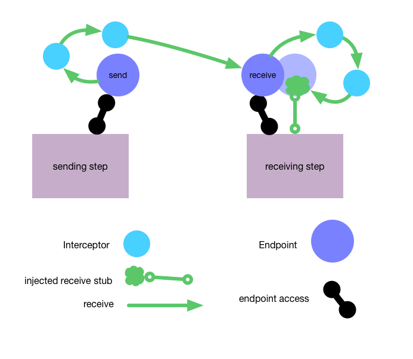

[](https://www.npmjs.com/package/kronos-step)
[](https://github.com/Kronos-Integration/kronos-step)
[](http://travis-ci.org/Kronos-Integration/kronos-step)
[](https://www.bithound.io/github/Kronos-Integration/kronos-step)
[](https://coveralls.io/r/Kronos-Integration/kronos-step)
[](https://codeclimate.com/github/Kronos-Integration/kronos-step)
[](https://github.com/Kronos-Integration/kronos-step/issues)
[](https://david-dm.org/Kronos-Integration/kronos-step)
[](https://david-dm.org/Kronos-Integration/kronos-step#info=devDependencies)
[](http://inch-ci.org/github/Kronos-Integration/kronos-step)
[](https://npmjs.org/package/kronos-step)




install
=======

With [npm](http://npmjs.org) do:

```shell
npm install kronos-step
```

license
=======

BSD-2-Clause
